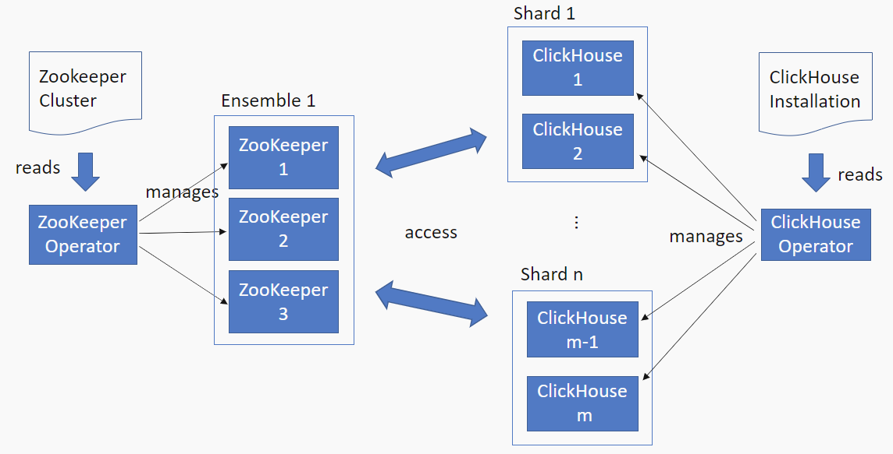
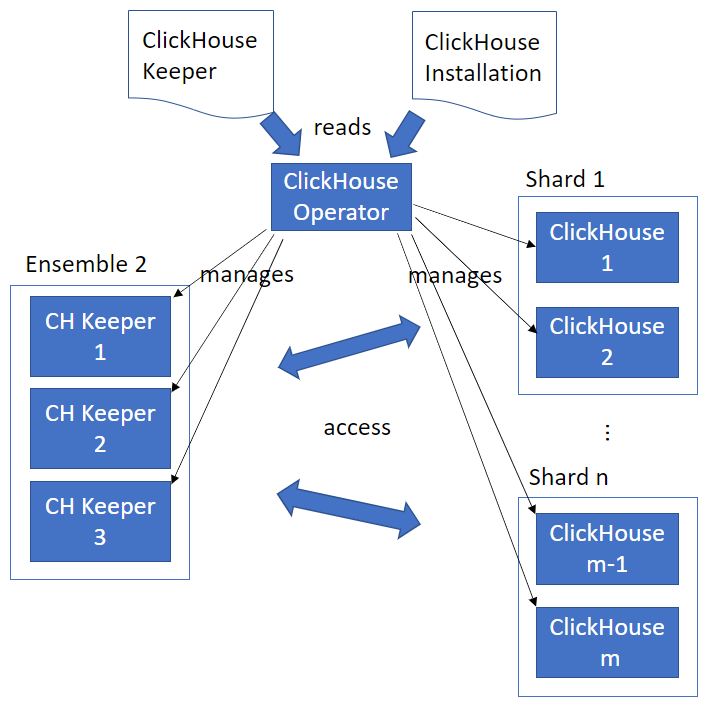

# Architecture

## Overview

ClickHouse Operator runs on a Kubernetes1 cluster to turn your ClickHouse cluster first citizen in cloud native era.

ClickHouse Operator is a Kubernetes operator2, which consists of a bunch of controllers to manipulate Kubernetes resources, such as Pods, Namespaces, ConfigMaps, or Events.

A running ClickHouse instance holds in-memory and on-disk states.
This makes a ClickHouse server an instance of a StatefulSet in Kubernetes.

Like a Deployment, a StatefulSet manages Pods that are based on an **identical** container spec. 
Unlike a Deployment, a StatefulSet maintains a sticky identity for each of their Pods. 
These pods are created from the same spec, but are not interchangeable: each has a persistent identifier that it maintains across any rescheduling.

## Replication and distributed DDL

Data replication is key for data availability.
To have this feature, ZooKeeper is required to work with ClickHouse cluster.
The following shows how ClickHouse Operator and ZooKeeper Operator3 work together to create a highly available ClickHouse cluster.

Due to ClickHouse Keeper is written in C++ and uses the RAFT algorithm implementation, using ClickHouse Keeper with ClickHouse Server is preferred.
In **v0.2.0-prerelease**, we added the ClickHouse Keeper support to this operator.
Now, you can give it a try applying a [ClickHouseKeeper custom resource](../deploy/clickhouse-keeper/) to create a ClickHouse Keeper cluster.
This way, you can deploy both ClickHouse Keepers and Servers with one operator.

## Control loop

As we know that an operator consists of controllers to do the heavy lifting on managing software components.
The figure below shows the context of the reconciliation loop, the core task performed by a controller.

 
Cited from [Why Implementing Kubernetes Operators Is a Good Idea!](https://www.kubermatic.com/blog/why-implementing-kubernetes-operators-is-a-good-idea/)

It first watches Custom Resources to understand the desired state.
Then, that state is compared against the actual state.
If there is any difference between them, the controller takes action to make them identical.
After that, the status is updated back to those Custom Resources.

This loop will run over and over again, if there is any difference between the desire and actual state.
Once, they are the same, the loop will stop unless there is any change on those custom resources or the actual state.

--

1 Read [Kubernetes Basics](https://kubernetes.io/docs/tutorials/kubernetes-basics/) for details 
2 Read [Exploring Kubernetes Operator Pattern](https://iximiuz.com/en/posts/kubernetes-operator-pattern/) for details 
3 One ZooKeeper Operator implementation can be found from [Zookeeper Operator](https://github.com/pravega/zookeeper-operator) 
