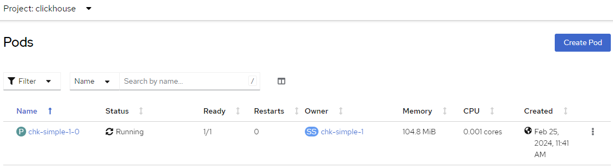

# Setting up ClickHouse Keeper

## Prerequisites

1. ClickHouse operator [installed][operator_installation_openshift.md]
1. Storage [configured][storage_openshift.md]

## Web GUI setup

### Namespace

Assume that you are going to host both clickhouse keeper and clickhouse server clusters within one namespace:

1. Select **Home > Projects** on the left, and click the **Create Project** button on the upper right corner.
1. Type ```<namespace>``` in the Name field and click the **Create** button as follows:\
  

### The ClickHouseKeeperInstallation

[Here](https://github.com/Altinity/clickhouse-operator/tree/master/docs/chk-examples) is a bunch of examples for your reference.

The ClickHouseKeeperInstallation (CHKI for short) can be as simple as complex as you want.
The simplest one can be as follows:

```yaml
apiVersion: "clickhouse-keeper.altinity.com/v1"
kind: "ClickHouseKeeperInstallation"
metadata:
  name: chk-simple-1
spec:
  configuration:
    clusters:
      - name: "simple-1"
```

This one tells the operator to use docker://clickhouse/clickhouse-keeper:head-alpine image and Services, PodDisruptionBudget and StatefulSet are created by it for you automatically.

To use IBM provided ClickHouse Keeper, add the podTemplates section as follows:

```yaml
apiVersion: "clickhouse-keeper.altinity.com/v1"
kind: "ClickHouseKeeperInstallation"
metadata:
  name: chk-simple-1
spec:
  configuration:
    clusters:
      - name: "simple-1"
  templates:
    podTemplates:
      - name: default
        spec:
          containers:
            - name: clickhouse-keeper
              image: icr.io/clickhouse/clickhouse:<server version you want>
              command:
                - clickhouse-keeper
                - --config-file=/etc/clickhouse-keeper/keeper_config.xml
```

1. Make sure you are in the ```clickhouse``` project (namespace), click the **plus** button near the top right corner\
    
1. Copy and paste the manifest above
1. Click the ```Create``` button to launch the cluster

    Now we can take a look into the ClickHouse Keeper cluster deployed in OpenShift:

## Explore ClickHouse Keeper cluster

### DNS names

We are expecting to have the ClickHouse Keeper cluster of 1 pod inside `clickhouse` namespace, named as:
```text
chk-simple-1-0
```

By clicking **Workloads > Pods** on the left, and switch to the project ```clickhouse```:




Those pods are expected to have short DNS names as:

```text
chk-simple-1-0.chk-simple-1.clickhouse
```

where `chk-simple-1-headless` is the name of ClickHouse Keeper headless service and `clickhouse` is name of [ClickHouse namespace](#namespace).

and full DNS names (FQDN) as:
```text
chk-simple-1-0.chk-simple-1.clickhouse.svc.cluster.local
```

### Other resources

* List services

  By clicking **Networking > Services** on the left, and switch to the project ```clickhouse```:

  

  Note that, by default, ClickHouse Keeper uses port ```9181``` instead of 2181 (the default port number used by ZooKeeper).
  To access the cluster, use ```chk-simple-1``` as the host name, if the clickhouse server cluster resides within the same namespace. Otherwise, use ```chk-simple-1.clickhouse``` or ```chk-simple-1.clickhouse.svc.cluster.local``` as the host name.

  If you want to use the port number 2181, add ```keeper_server/tcp_port: "2181"``` to the settings section in the CHKI as follows:
  ```yaml
  spec:
    configuration:
      settings:
        keeper_server/tcp_port: "2181"
  ```

* List statefulsets

  By clicking **Workloads > StatefulSets** on the left, and switch to the project ```clickhouse```:

  

  In case all looks fine the ClickHouse Keeper cluster is up and running


[operator_installation_openshift.md]: ./operator_installation_openshift.md
[storage_openshift.md]: ./storage_openshift.md
