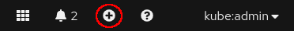
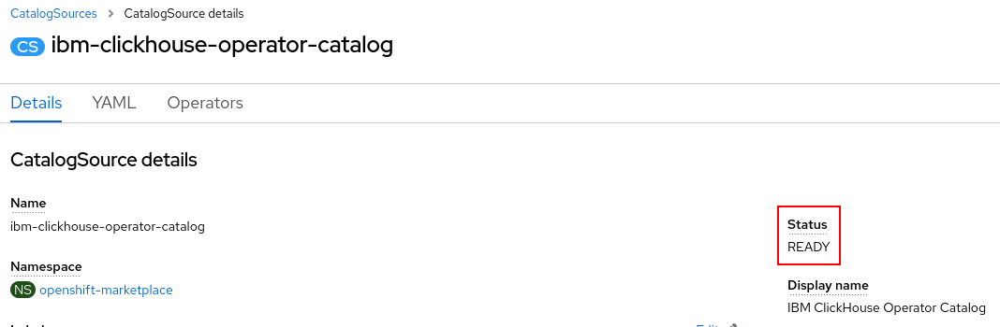
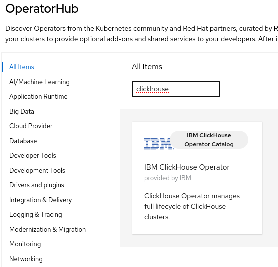
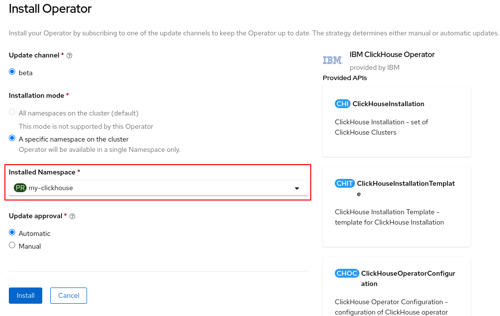
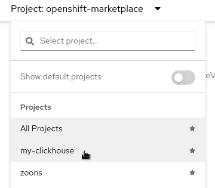
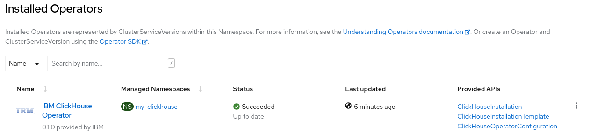

# Install ClickHouse Operator

## Prerequisites

1. OpenShift version from 4.10.x to 4.13.x
1. The `oc` command, downloadable from [here](https://mirror.openshift.com/pub/openshift-v4/clients/ocp/stable/).
1. Properly configured `kubectl`
1. `curl`

## ZooKeeper

If you need data replication, please install a ZooKeeper cluster on the same OpenShift by following [ZooKeeper Setup](./zookeeper_setup_openshift.md).

## Install via OperatorHub GUI

### Create a new project

Note: If you're going to use the **All namespaces** install mode, you can skip the following steps.

1. Click **Home > Projects** on the left, then
1. Click the **Create Project** button on the right
1. Type a proper name in the **Name**, such as `my-clickhouse`
1. Click the **Create** button

### Add Catalog Source

1. Click the **plus** button near the top right corner\
    
1. Paste the following yaml file to the text box, and click the **Create** button at the bottom.
    ```yaml
    apiVersion: operators.coreos.com/v1alpha1
    kind: CatalogSource
    metadata:
      name: ibm-clickhouse-operator-catalog
      namespace: openshift-marketplace 
    spec:
      sourceType: grpc
      image: icr.io/cpopen/clickhouse-operator-catalog:<version>
      displayName: IBM ClickHouse Operator Catalog
    ```
    Note: Please specify the right image version tag while adding the catalog source.
    All available releases can be found [here](../releases).
    
    After a while, you will see the catalog is ready as follows:
    

### Install operator from OperatorHub

1. Go to **Operators > OperatorHub** on the left
1. Type `clickhouse` into **Filter by keyword...** input box, the **IBM ClickHouse Operator** tile will be shown as follows:
    
1. Click the tile and the installation page will appear
1. Click the **Install** button to go to the configuration page:
    
1. If you choose to install the operator for all namespaces, the **openshift-operators** namespace will automatically selected.
   Otherwise, select the previously created namespace, such as `my-clickhouse` and click the **Install** button.
   After a while, you will see the message: Installed operator - ready for use.

### Verify operator is running

1. Click **Operators > Installed Operator** on the left, and switch project to the desired one, such as `my-clickhouse` as follows:\
    
1. After you switch to the desired namespace, you can see it is in the Installed Operators list.
    