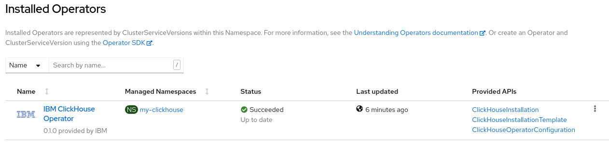

# Uninstall ClickHouse Operator

## Prerequisites

1. IBM ClickHouse Operator is installed on an OpenShift
1. This operator was installed by following [operator_installation_openshift.md](./operator_installation_openshift.md)

## Uninstall via OpenShift GUI

### Check what operators had been installed

1. Click **Operators > Installed Operators** on the left, then
1. Click the **Project** dropdown list, and select `All Projects`\
    \
    and you can find the installed IBM ClickHouse Operator\
    

### Uninstall the operator

1. On the right of the installed operator, click the three dots button\
    \
    and select `Uninstall Operator`
1. On the Uninstall Operator popup, you can click the lower right **Uninstall** button to delete it right away.\
    \
    Or, check the `Delete all operand instances for this operator` box, then click the **Uninstall** button to uninstall 
    resources managed with the operator together.

### Verify operator is gone

1. Click **Operators > Installed Operator** on the left, and switch project to All projects.
1. After you switch to All projects, you can not find the operator you just uninstalled.