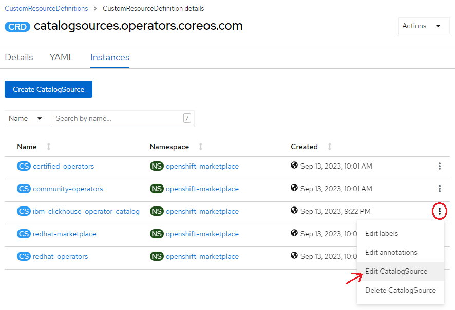
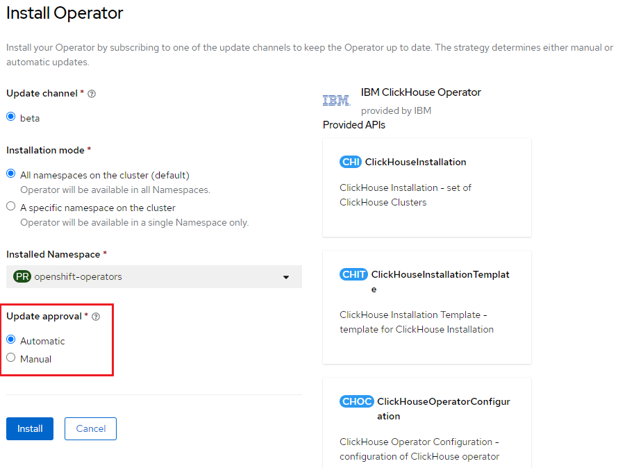

# Operator update

Updating operator on OpenShift is quite straight-forward.

1. Select **Administration > CustomResourceDefinitions** on the left of the console
1. Click ```CatalogSource``` on the list, or type it in **Search by name...** text field to nail down the list
1. Switch to the **Instances** tab, and see all instances of the Catalog Source\
    
1. Click the three dot button on the row of ```ibm-clickhouse-operator-catalog```, and click **Edit CatalogSource**
1. Replace the image tag to the desire version, and click the **Save** button.
    ```yaml
    apiVersion: operators.coreos.com/v1alpha1
    kind: CatalogSource
    metadata:
      creationTimestamp: '2023-09-13T13:22:13Z'
      generation: 5
      name: ibm-clickhouse-operator-catalog
      namespace: openshift-marketplace
      resourceVersion: '531914'
      uid: ee71c609-8a83-478d-8082-2e96ea3fdc8b
    spec:
      displayName: IBM ClickHouse Operator Catalog
      image: 'icr.io/cpopen/ibm-clickhouse-operator-catalog:<updated tag>'
      sourceType: grpc
    status:
      connectionState:
        address: 'ibm-clickhouse-operator-catalog.openshift-marketplace.svc:50051'
        lastConnect: '2023-09-14T05:24:57Z'
        lastObservedState: READY
      registryService:
        createdAt: '2023-09-14T05:24:18Z'
        port: '50051'
        protocol: grpc
        serviceName: ibm-clickhouse-operator-catalog
        serviceNamespace: openshift-marketplace
    ```
    After that, OpenShift will automatically update the operator version to the desired one if you chose automatic update approval previously.
    
