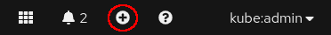

# Setup ClickHouse cluster with data replication

## Prerequisites

1. ClickHouse operator [installed][operator_installation_openshift.md]
1. Zookeeper [installed][zookeeper_setup_openshift.md]


## Manifest

Let's take a look on the following manifest, which creates a cluster with 1 shard, 2 replicas and the persistent storage.

```yaml
apiVersion: "clickhouse.altinity.com/v1"
kind: "ClickHouseInstallation"

metadata:
  name: "repl-05"

spec:
  defaults:
    templates: 
      dataVolumeClaimTemplate: default
      podTemplate: clickhouse:23.3
 
  configuration:
    zookeeper:
      nodes:
      - host: zookeeper.zoons.svc.cluster.local
    clusters:
      - name: replicated
        layout:
          shardsCount: 1
          replicasCount: 2
        secret:
          auto: "true"
    users:
      default/networks/ip: "::/0"
      default/password: <default_password>

  templates:
    volumeClaimTemplates:
      - name: default
        spec:
          accessModes:
            - ReadWriteOnce
          resources:
            requests:
              storage: 500Mi
    podTemplates:
      - name: clickhouse:23.3
        spec:
          containers:
            - name: clickhouse-pod
              image: icr.io/clickhouse/clickhouse:23.3.2.37-3-lts-ibm
```

1. Make sure you are in the desired project, i.e. my-clickhouse.
    Click the **plus** button near the top right corner\
    
1. Copy and paste the ```ClickHouseInstallation``` manifest above.
    Replace the placeholder password with real one you want to use, and click the **Create** button.

## Replicated table setup

### Macros
Operator provides set of [macros][macros], which are:
 1. `{installation}` -- ClickHouse Installation name
 1. `{cluster}` -- primary cluster name
 1. `{replica}` -- replica name in the cluster, maps to pod service name
 1. `{shard}` -- shard id

ClickHouse also supports internal macros `{database}` and `{table}` that maps to current **database** and **table** respectively.

### Create replicated table

Now we can create [replicated table][replication], using specified macros

```sql
CREATE TABLE events_local on cluster '{cluster}' (
    event_date  Date,
    event_type  Int32,
    article_id  Int32,
    title       String
) engine=ReplicatedMergeTree('/clickhouse/{installation}/{cluster}/tables/{shard}/{database}/{table}', '{replica}')
PARTITION BY toYYYYMM(event_date)
ORDER BY (event_type, article_id);
```

```sql
CREATE TABLE events on cluster '{cluster}' AS events_local
ENGINE = Distributed('{cluster}', default, events_local, rand());
```

We can generate some data:
```sql
INSERT INTO events SELECT today(), rand()%3, number, 'my title' FROM numbers(100);
```

And check how these data are distributed over the cluster
```sql
SELECT count() FROM events;
SELECT count() FROM events_local;
```

[operator_installation_openshift.md]: ./operator_installation_openshift.md
[zookeeper_setup_openshift.md]: ./zookeeper_setup_openshift.md
[macros]: https://clickhouse.com/docs/en/operations/server-configuration-parameters/settings#macros
[replication]: https://clickhouse.com/docs/en/engines/table-engines/mergetree-family/replication
