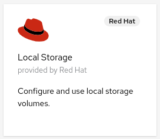
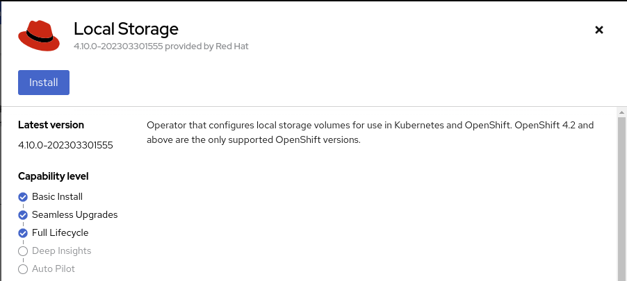
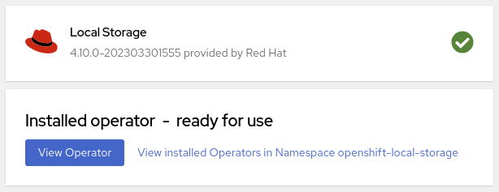
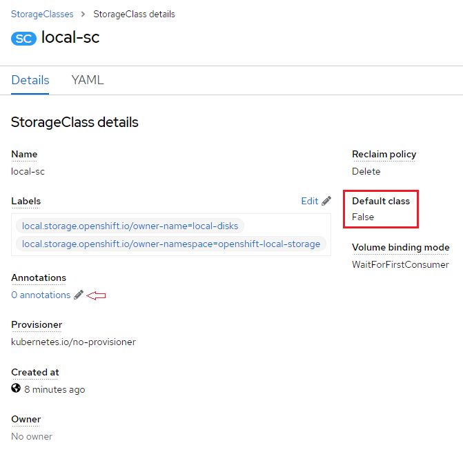
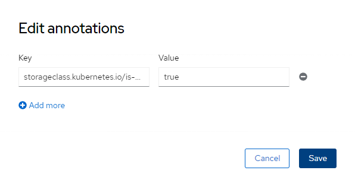

# Storage on OpenShift

For general introduction to storage on Kubernetes, please refer to [storage](https://github.com/Altinity/clickhouse-operator/blob/master/docs/storage.md).
In addition, you can read [OpenShift Container Platform storage overview](https://docs.openshift.com/container-platform/latest/storage/index.html) to understand more OpenShift specific information.

Here will provide instructions for setting up a local storage class.


## The local storage class

Local persistent volumes allow you to access local storage devices, such as a disk or partition, by using the standard persistent volume claim interface.

Local volumes can be used without manually scheduling pods to nodes because the system is aware of the volume node constraints.
However, local volumes are still subject to the availability of the underlying node and are not suitable for all applications.

1. In OpenShift, we can leverage [Local Storage Operator](https://github.com/openshift/local-storage-operator) to manage local volumes for us.
    After logging on to OpenShift, select **Operators > OperatorHub** on the left.
    In the "Filter by keyword" input box, type ```local``` and click the **Local Storage** tile as follows:\
    \
1. Click the **install** button\
    \
1. And scroll down to the bottom on the next page. At the end, click the **install** button to get it going. After a while, you will see the following means the installation is completed:\
    

Assume that your OpenShift have two extra disks on each worker node. The following LocalVolume custom resource can be used by the Local Storage Operator to create **local-sc** storage class.

1. Click the **plus** button near the top right corner\
    
1. Paste the following yaml file to the text box, and click the **Create** button at the bottom.
    ```yaml
    apiVersion: "local.storage.openshift.io/v1"
    kind: "LocalVolume"
    metadata:
      name: "local-disks"
      namespace: "openshift-local-storage"
    spec:
      nodeSelector:
        nodeSelectorTerms:
          - matchExpressions:
            - key: kubernetes.io/hostname
              operator: In
              values:
                - worker0.<domain>.cp.fyre.ibm.com
                - worker1.<domain>.cp.fyre.ibm.com
                - worker2.<domain>.cp.fyre.ibm.com
      storageClassDevices:
        - storageClassName: "local-sc"
          volumeMode: Filesystem
          fsType: xfs
          devicePaths:
            - /dev/vdb
            - /dev/vdc
    ```
    Note: You need to change &lt;domain> to match your cluster's settings. Change /dev/vdb and /dev/vdc to match your node's configuration if needed.
1. Optional.
    After the **local-sc** storage class is available. Select **Storage > StorageClasses** on the left, and then click **local-sc**.
    
    
    As you can see, this storage class is not the default one, even this is the first storage class configured.
    By clicking the Pencil icon in the Annotation section, you can assign the ```true``` value to the annotation ```storageclass.kubernetes.io/is-default-class``` as follows:
    
    

    If you prefer using command line, issue the following command to make ```local-sc``` the default storage class:
    ```bash
    kubectl patch storageclass local-sc -n openshift-local-storage -p '{"metadata": {"annotations":{"storageclass.kubernetes.io/is-default-class":"true"}}}'
    ```
