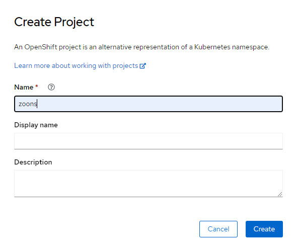
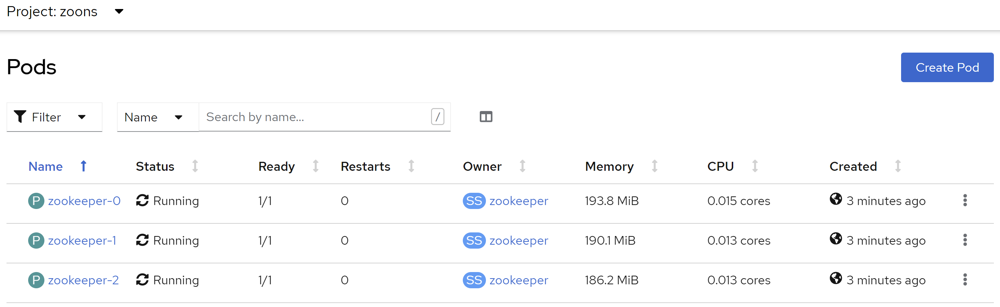

# Setting up Zookeeper

Before setting up the Zookeeper cluster, please setup a storage class by following [storage_openshift](./storage_openshift.md).

## Web GUI setup

### Namespace

1. Select **Home > Projects** on the left, and click the **Create Project** button on the upper right corner.
1. Type ```zoons``` in the Name field and click the **Create** button as follows:\
  

### Zookeeper service

1. Make sure you are in the ```zoons``` project (namespace), click the **plus** button near the top right corner\
    
1. Copy and paste the following manifest to create the service:
    ```yaml
    # Setup Service to provide access to Zookeeper for clients
    apiVersion: v1
    kind: Service
    metadata:
      name: zookeeper
      labels:
        app: zookeeper
    spec:
      ports:
        - port: 2181
          name: client
        - port: 7000
          name: prometheus
      selector:
        app: zookeeper
        what: node
    ```
1. By following previous steps, copy and paste the following manifest to create headless service:
    ```yaml
    # Setup Headless Service for StatefulSet
    apiVersion: v1
    kind: Service
    metadata:
      name: zookeepers
      labels:
        app: zookeeper
    spec:
      ports:
        - port: 2888
          name: server
        - port: 3888
          name: leader-election
      clusterIP: None
      selector:
        app: zookeeper
        what: node
    ```

### Disruption budget

1. Click the **plus** button near the top right corner\
    
1. Copy and paste the following manifest to create headless service:
    ```yaml
    # Setup max number of unavailable pods in StatefulSet
    apiVersion: policy/v1
    kind: PodDisruptionBudget
    metadata:
      name: zookeeper-pod-disruption-budget
    spec:
      selector:
        matchLabels:
          app: zookeeper
      maxUnavailable: 1
    ```

### Stateful set

1. Optional.
    Edit **StatefulSet manifest with Persistent Volume** [05-stateful-set-persistent-volume-openshift.yaml][05-stateful-set-persistent-volume-openshift.yaml] according to your storage preferences.
    In case we'd go with **Persistent Volume** storage, ensure `.spec.volumeClaimTemplates` is there as follows.
    ```yaml
      volumeClaimTemplates:
        - metadata:
            name: datadir-volume
          spec:
            accessModes:
              - ReadWriteOnce
            resources:
              requests:
                storage: 25Gi
    ```
    Note: There is no **storageClassName** specified here. This implies the default storage class will be used. If you need to use other storage class, please specify it under the **spec** property.
1. Click the **plus** button near the top right corner\
    
1. Copy and paste the [05-stateful-set-persistent-volume-openshift.yaml][05-stateful-set-persistent-volume-openshift.yaml] or the modified one to create the stateful set.

    Now we can take a look into Zookeeper cluster deployed in k8s:

## Explore Zookeeper cluster

### DNS names

We are expecting to have Zookeeper cluster of 3 pods inside `zoons` namespace, named as:
```text
zookeeper-0
zookeeper-1
zookeeper-2
```

By clicking **Workloads > Pods** on the left, and switch to the project ```zoons```: \



Those pods are expected to have short DNS names as:

```text
zookeeper-0.zookeepers.zoons
zookeeper-1.zookeepers.zoons
zookeeper-2.zookeepers.zoons
```

where `zookeepers` is the name of Zookeeper headless service and `zoons` is name of [Zookeeper namespace](#namespace).

and full DNS names (FQDN) as:
```text
zookeeper-0.zookeepers.zoons.svc.cluster.local
zookeeper-1.zookeepers.zoons.svc.cluster.local
zookeeper-2.zookeepers.zoons.svc.cluster.local
```

### Resources

List pods in Zookeeper's namespace
```bash
kubectl get pod -n zoons
```

Expected output is like the following
```text
NAME             READY   STATUS    RESTARTS   AGE
zookeeper-0      1/1     Running   0          9m2s
zookeeper-1      1/1     Running   0          9m2s
zookeeper-2      1/1     Running   0          9m2s
```

List services
```bash
kubectl get service -n zoons
```

Expected output is like the following
```text
NAME                   TYPE        CLUSTER-IP     EXTERNAL-IP   PORT(S)                      AGE
zookeeper              ClusterIP   10.108.36.44   <none>        2181/TCP                     168m
zookeepers             ClusterIP   None           <none>        2888/TCP,3888/TCP            31m
```

List statefulsets
```bash
kubectl get statefulset -n zoons
```

Expected output is like the following
```text
NAME            READY   AGE
zookeepers      3/3     10m
```

In case all looks fine Zookeeper cluster is up and running


[05-stateful-set-persistent-volume-openshift.yaml]: ../deploy/zookeeper/advanced/05-stateful-set-persistent-volume-openshift.yaml
